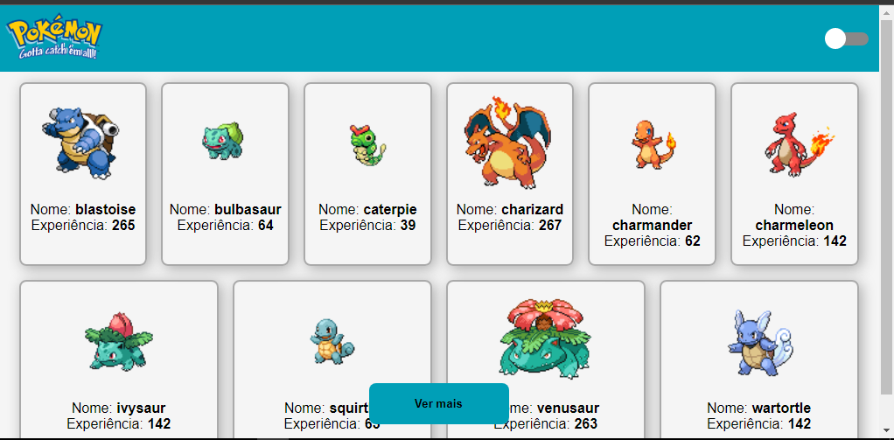
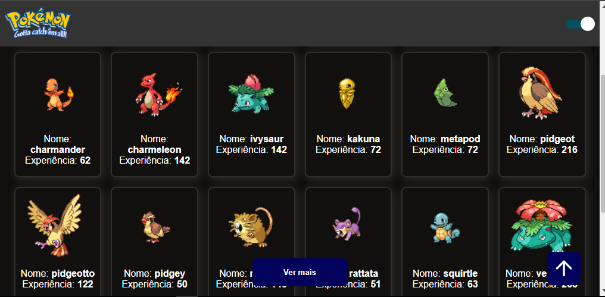

# Projeto mostra Pokemons

Este `Projeto` foi desenvolvido para fins de exercicío com o objetivo de melhorar as minhas `habilidades` em `TypeScript` e `React`. Este `projeto` exibe uma lista de `pokemons` da mesma `API` é um projecto simples mas desafiador o projecto também tem algumas funcionalidades adicionais como um `butão para ver mais pokemons` tem dois tema `dark` e `light` e ainda um `icone` para fazer um `scroll` até o inicío da página claro se usuário já fazer um scroll para baixo.

## Tecnologias

As seguintes ferramentas foram usadas na constuição deste projeto:

- HTML
- STYLED-COMPONENTS
- TYPESCRIPT
- REACT

#

Feito por ❤ Pascoal Kahamba meu [Linkedin](https://www.linkedin.com/in/pascoal-kahamba-7b43bb233?lipi=urn%3Ali%3Apage%3Ad_flagship3_profile_view_base_contact_details%3BTg8LEKayToyytOX1pVAQ%2Bg%3D%3D)

[👉Clique aqui para rodar o projeto👈](https://cosuming-api-pokemon.vercel.app/)😎
